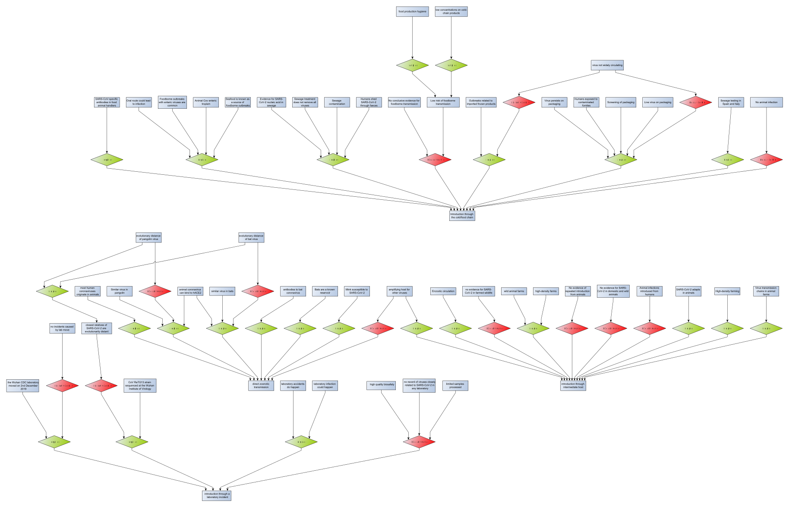

# Origins of the SARS-CoV-2 virus

The WHO report into the [origins of the SARS-CoV-2 virus](https://www.who.int/health-topics/coronavirus/origins-of-the-virus) has a section 
discussing four possible pathways of emergence for the virus and presenting arguments for and against each hypothesis.

We can take the facts expressed in these arguments and create an [information list](information.xhtml). Entries from the list may be 
used as I-nodes in an AIF argument map. For example this argument map aims to reconstruct the arguments presented in the WHO report:

See the [*Argumentation*](/eleatics/argumentation) page for instructions on extracting AIF from this GraphML.

An argument may be easier to follow if expressed as text rather than drawn. To that end, the [information list](information.xhtml) is represented as an 
HTML *description list*, so that each I-node is a term giving a label to the description that is its _claimText_ property. The intention 
here is that the term labels can be used in sentences that string together premises and conclusions to make arguments. The [WHO arguments](origins-who.xhtml) 
are an example of AIF argument map constructed this way. It is equivalent to the argument map depicted above.

