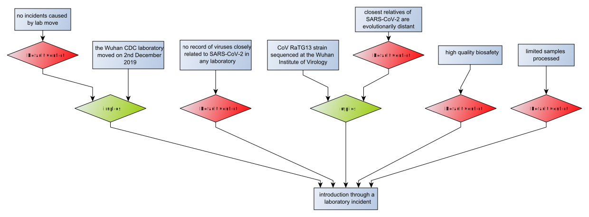

# Uncertainty

In most cases, as in the [Origins of SARS-CoV-2](index.html) example, evaluating an argument map doesn't produce a definite answer; and
there is *uncertainty* associated with any conclusions you might draw.

Consider the arguments for and against just the laboratory origin hypothesis in isolation:

Evaluating this argument map will produce a number of extensions, and in each extension the *Introduction through a laboratory incident* hypothesis will be either
"true" (acceptable) or "false" (unacceptable). We can collect all the "true" extensions into one set and regard it as the
case in support of the hypothesis:

 ... and we can make the case against the lab origin in the same way:
 
 
 
The "true" and "false" conclusions partition the set of all extensions, and we can choose how the acceptable arguments in each extension
combine to make an explanation graph for the partition. Here, we have chosen to consider *necessary* arguments, which is to say arguments
that are acceptable in all the extensions in a partition. In the case against the laboratory origin this includes two undercutting arguments,
so including these in an explanation graph means also including the arguments that are undercut. The case in favour of the lab hypothesis consists
of just the unchallenged arguments in support.

The two explanation graphs answer the question: *What must we believe if we accept the hypothesis is true/false?* This is a critical assessment
of the hypothesis. Instead, we might be interested in promoting a particular point of view, so asking what *might* we believe instead of what *must* we
believe. We can do this by considering *sufficient* arguments instead of necessary ones. That is to say, the arguments that are acceptable in at least one
extension in the relevant partition. There are choices in constructing an explanation graph that bear on what the graph explains.

Here, we have generated explanations that allow a critical assessment of the strength of the case for and against the lab origin hypothesis; and these
explanations can be used to say something about the *uncertainty* associated with the hypothesis. It's possible to make a judgement about an explanation
graph just from consideration of its structure. However, a more detailed analysis requires some consideration of the "strength" or "quality" of the
indiviudual inferences. This can be done by classifying each inference as an instance of an
[argumentation scheme](https://en.wikipedia.org/wiki/Argumentation_scheme). An analysis of the schemes then answers questions about *uncertainty* - and
perhaps similar questions about *credibility* and *belief*.
