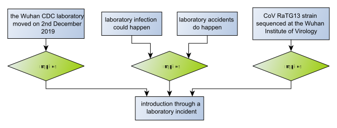

# Uncertainty

In most cases, as in the [Origins of SARS-CoV-2](index.html) example, evaluating an argument map doesn't produce a definite answer; and
there is *uncertainty* associated with any conclusions you might draw.

Consider the arguments for and against just the laboratory origin hypothesis in isolation:

Evaluating this argument map will produce a number of extensions, and in each extension the *Introduction through a laboratory incident* hypothesis will be either
"true" (acceptable) or "false" (unacceptable). We can collect all the "true" extensions into one set and regard it as the
case in support of the hypothesis:

 ... and we can make the case against the lab origin in the same way:
 
 
 
The "true" and "false" conclusions partition the set of all extensions, and we can choose how the acceptable arguments in each extension
combine to make an explanation graph for the partition. Here, we have chosen to consider *necessary* arguments, which is to say arguments
that are acceptable in all the extensions in a partition. In the case against laboratory origin there are two undercutting arguments,
so including these in an explanation graph means also including the arguments that are undercut. The case in favour of the lab hypothesis consists
of just the unchallenged arguments in support.

The two explanation graphs answer the question: *What must we believe if we accept the hypothesis is true/false?* This is a critical assessment
of the hypothesis. Instead, we might be interested in promoting a particular point of view, so asking what *might* we believe instead of what *must* we
believe. We can do this by considering *sufficient* arguments instead of necessary ones. That is to say, the arguments that are acceptable in at least one
extension in the relevant partition. The case against lab origin doesn't change if we do this, but the case in favour now includes the two defeated arguments:

There are choices in constructing an explanation graph that bear on what the graph explains.
Here, we have generated explanations that allow a critical assessment of the strength of the case for and against the lab origin hypothesis, and these
explanations can be used to say something about the *uncertainty* associated with the hypothesis. It's possible to make a judgement about an explanation
graph just from consideration of its structure, but a more detailed analysis requires some consideration of the "strength" or "quality" of the
individual inferences. This can be done by classifying each inference as an instance of an
[argumentation scheme](https://en.wikipedia.org/wiki/Argumentation_scheme). An analysis of the schemes then answers questions about *uncertainty* - and
perhaps similar questions about *credibility* and *belief*.

We should also consider the *evidence* on which the arguments are based; that is to say the *I-nodes* that are premises only, and not the conclusion of some
inference. Such premises may be accepted fact, assumptions, or even opinion. We can imagine each piece of evidence as the conclusion of a notional argument
that says something about it's uncertainty. The [technical wiki](https://github.com/dstl/eleatics/wiki/Argumentation-Schemes) has more on this idea.

## Drawing Conclusions

### Subjectively ...
We can make a qualitative judgement about the likelihood of a laboratory origin of the virus by considering the cases for and against in terms of the argumentation schemes (for presumptive reasoning) that are employed. The arguments "for" are *slippery slope*, or even *begging the question*. The arguments "against" are *expert opinion*, *falsification of a hypothesis* and *evidence to a hypothesis*. The latter seem much more credible, and therefore make the case "against" more certain.

We can get some sense of the strength of the cases "for" and "against" by looking at their explanation graphs. Again, the case "against" seems more credible: It's a larger graph, and it includes arguments that counter some of those made in the case "for". Is this a fair judgement to make? It rather assumes that some proponent on each side has had the opportunity to appraise and counter the arguments of the opposition, which may not be the case. Let's say inspecting the structure of the explanation graphs *biases* the judgement in favour of the case "against".

### Objectively ...
It's always possible to put numbers on something, and the subjective analysis described above could be codified in terms of probabilities, partial orderings, or graph metrics. The questions to consider are: *Where do the numbers come from?*, *How and when are they applied?* and *What does the final result mean?* There is a lot of research into such methods, which largely focuses on the middle question.

Argumentation theories are layered on top of [Dung's Abtract Argumentation Framework (AAF)](https://en.wikipedia.org/wiki/Argumentation_framework). It the AAF that is evaluated to produce consistent sets of arguments called *extensions*, and these extensions may be classified according to a number of *extension semantics*. The "how and when" question for some new "objective" argumentation theory must consider translating the numbers from some high-level argument representation (AIF say) to the AAF, and whether they affect the construction of the AAF or its evaluation. There are many possible choices here.

## Notes

1. The images of the argument maps above link to corresponding GraphML files, and [AIF can be recovered](https://github.com/dstl/eleatics/wiki/Argument-Maps) from these.

1. There are many ways to fold uncertainty into argumentation, and the example described here shouldn't be interpreted as prescribing a particular approach, but rather as a strawman to test ideas and elicit alternatives. For this reason, we aim to preserve the argument map as a simple expression of defeasible logic, and layer consideration of uncertainty over that using argumentation schemes. In this example, we ignore the uncertainties when the argument map is evaluated, but consider them as the results of the evaluation are *explained*. An alternative approach might be to take account of uncertainty when evaluating the argument map, as happens in [probabilistic argumentation frameworks](https://en.wikipedia.org/wiki/Probabilistic_argumentation) for example.

1. Uncertainty is context sensitive, changing over time as knowledge (and arguments) develop. How it is best communicated depends significantly on the requirements and knowledge of the target audience. Communication of uncertainty may be as simple as presenting a single score of some kind, or it might involve some complex additional process such as engaging the audience in a socratic dialogue intended to develop understanding. This suggests that there may be no single "best" way to assess and communicate uncertainty.

1. The arguments presented here are somewhat sterile in that they are simply lifted from the conclusions in the WHO report, without regard to any discussion in the body of that report. Further, they present the argument from one point-of-view, so there is no dialogue or dispute. A more contested argument might allow a more interesting and realistic assement of the associated uncertainty.
