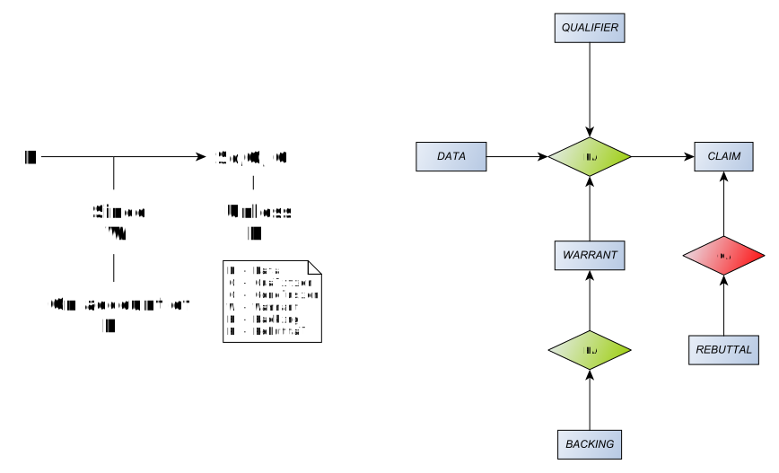

# Toulmin's argument layout

In his book [*The Uses of Argument*](https://www.cambridge.org/core/books/uses-of-argument/26CF801BC12004587B66778297D5567C), 
[Stephen Toulmin](https://en.wikipedia.org/wiki/Stephen_Toulmin) describes a general pattern for arguments:

On the left is Toulmin's depiction. On the right is is an equivalent [AIF argument map](toulmin-aif.graphml).

The same AIF argument map can be expressed as [XHTML+RDFa](toulmin.xhtml).
