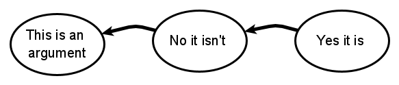
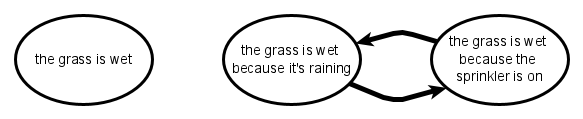
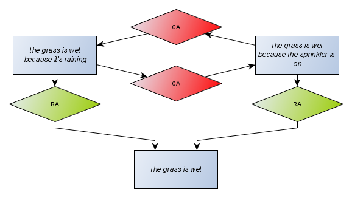

# Introducing Argumentation
Argumentation is the process of reasoning systematically in support of an idea. It is about *presumptive* reasoning; letting you construct an argument that infers a conclusion from premises regardless of whether that inference is correct or not, though you presume it is. One argument can be attacked by another that *undermines* its premise, *rebuts* its conclusion, or *undercuts* its inference. An attacked argument can be defended by attacking its attacker, and so it goes ... 
 
 
 
## Mathematics
Mathematically, argumentation can be modelled as a graph - with nodes representing arguments, and directed edges representing the attacks between them. This is the seminal [*argumentation framework*](https://dstl.github.io/eleatics/doc/dung-framework.html) proposed by Phan Minh Dung. Given a set of arguments, Dung deems that an individual argument is *acceptable* if it isn't attacked by any other members of the set, or if it is defended by successful attacks on its attackers.

Any set of arguments taken from an argumentation framework is called an *extension* of the framework. Evaluating an argumentation framework means finding extensions that have interesting properties. An argument in an extension is acceptable with respect to that extension if there are no arguments in the framework that attack it, or any arguments that do attack are themselves attacked by a member of the extension. An extension is *conflict-free* if it doesn't include any attacks. An extension that is both acceptable and conflict-free is *admissible*.

The key idea here is that we can take an argumentation framework, full of conflict and contradiction, and break it down into sets of coherent arguments \(admissible extensions\) that represent the conflicting viewpoints. For example, if we consider an argument about why the grass is wet ...

... then the only argument that is immediately acceptable is the claim that it is raining. The reason why is in dispute. Evaluating the framework produces two extensions with two arguments in each: either we can believe the grass is wet and it's raining, or we can believe the grass is wet and the sprinkler is on.

Note that each of the three arguments considered in isolation is valid as an admissible extension, but not all admissible extensions are useful or interesting. We can further classify admissible extensions in various ways. A *complete* extension contains all the arguments acceptable to its members. A *stable* extension attacks \(i.e. any one of its members attacks\) every argument in the framework it doesn't include; and our two extensions are both stable and complete. Finding stable extensions is useful because they represent views that explicitly counter alternatives. However, there may not be a stable extension. A *grounded* extension is the smallest set of arguments common to all the complete extensions. It represents the arguments that you can be "sure about", or that are "uncontroversial", because they are acceptable in all complete extensions - so here, we're happy to take on faith "the grass is wet". Applying meaningful labels to sets of extensions is the game of *extension semantics* and a fertile area for research.
 
Dung's theory doesn't have anything to say about what argument is or what it means. It is simply about deciding whether or not the arguments within a framework are acceptable. It doesn't say if any argument is true, or credible, or correct, or certain - just that it is acceptable.
 
## Philosophy
The [philosophy of argumentation](https://plato.stanford.edu/entries/argument/#ArguTheo) studies types of argument and how argumentation is applied. As well as rational arguments, it considers irrational arguments that are biased, fallacious or emotional - extending argumentation into the fields of cognitive science and psychology. It considers the structures of dialogue and discourse, applying notions such as illocutionary acts for this purpose.

A stereotypical pattern of argument is an *argumentation scheme*. As well as classifying the type of reasoning employed, an argumentation scheme suggests critical questions that might be employed to test the argument, and may also say something about its "quality" or "strength". For example, an *Argument from Sign* might  be considered weaker than an *Argument from Evidence to Hypothesis*.

## Mathematics again
The Dung framework is concerned with just arguments and attacks. This isn't the way people argue. For instance, it's often more natural to *support* an argument rather than attack its attacker. It's also the way logical inference works; where we might have propositional variables, and rules that cast them as premises and conclusions. Logical inference rules are *strict* in the sense that conclusions must follow if the premises are true. For the purposes of argumentation, we can consider *defeasible* inference where conclusions are assumed to follow from premises unless contradicted by another rule. [ASPIC+](https://dstl.github.io/eleatics/doc/aspic.html) is an argumentation theory that works on this basis. It constructs a Dung argument framework by forming arguments from chains of consistent inference rules, and attacks from logical contradictions between those chains. The method ensures that admissible extensions equates to consistent sets of logical rules in the original formulation.

An argumentation framework puts all the arguments on an equal footing. If two arguments are mutually contradictory, you end up with at least two equally valid extensions. This will often be what you want, but there may be occasions when you prefer one argument over another if they conflict. For example, you may have a general "birds fly" argument that is is overruled by a more specific "penguins don't" argument if the bird in question happens to be a penguin, or may have an argument from a trusted source that you prefer over one from an untrusted source if the two conflict. This is *preference*.

Preference is handled by adding a partial ordering of arguments to an argumentation framework to make a *structured argumentation framework*. The partial ordering is taken into account when the argumentation framework to be evaluated is constructed, so that any attack from a less preferred argument against a more preferred argument is omitted from the construction.

Extending Dung's argumentation framework to include some other mathematical object \(like a logical language, or a partial ordering, or a probability distribution\) creates an *argumentation theory*. There are lots of these, and argumentation these days is usually applied in terms of some argumentation theory; which is why what Dung called an *argumentation framework* is generally now referred to as Dung's *abstract argumentation framework*. 

## Argumentation Models
The mathematical models of argumentation translate directly into computer algorithms but don't really represent the way people argue. Philosophical models of argumentation capture the way people argue but don't translate readily into computer algorithms. There are problems in translating between models of argumentation to solve if our goal is to allow a human to engage in dialogue with a machine.

The first step in solving these issues is to adopt a modelling language that any argumentation model can use. This is the Argument Interchange Format \(AIF\). It represents arguments as graphs called *argument maps*:

An argument map has two basic types of nodes: *information nodes* and *structure nodes*. Information nodes \(rectangles\) represent premises, conclusions, facts, and claims in general. Structure nodes \(lozenges\) connect information nodes in relationships of support \(green Rule Application lozenges\) and conflict \(red Conflict Application lozenges\).

[AIF+](https://dstl.github.io/eleatics/doc/grass-dialogue.html) extends core AIF to model dialogue and discourse. It extends information nodes to *locution nodes* that tie an argument to a speaker, and it extends structure nodes to capture transitions between locutions in a debate, and the illocutionary force that links the locution to a corresponding argument.
